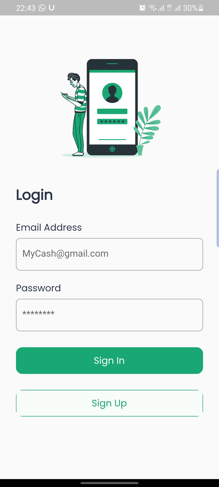
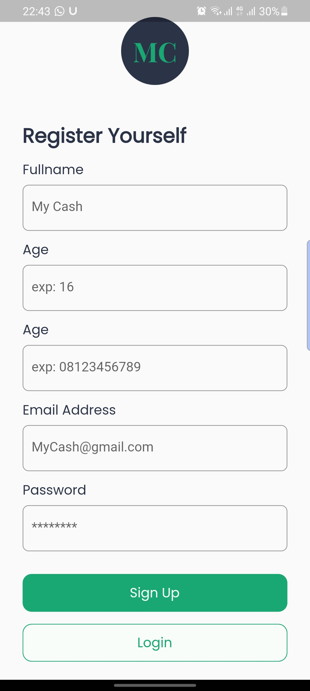
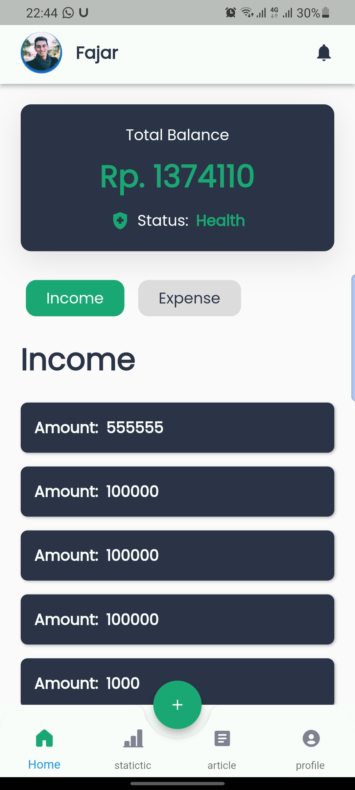
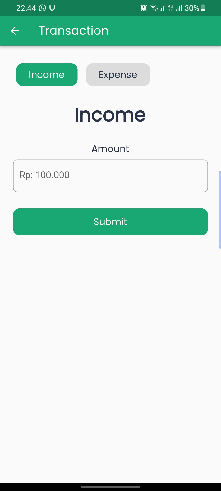
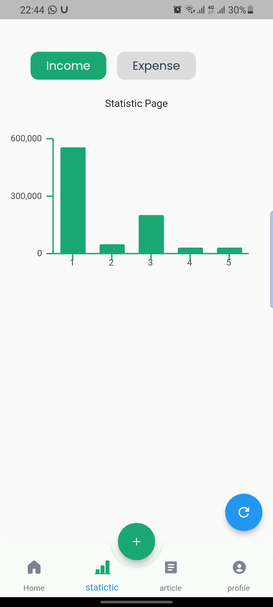
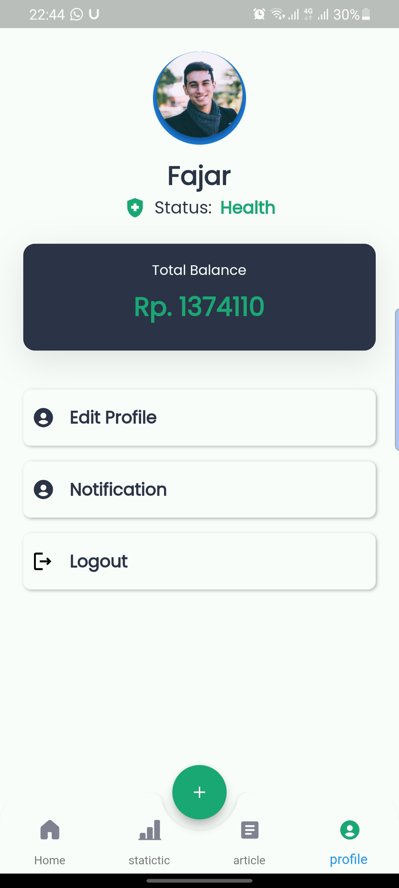

# myCash_full
Integration between FrontEnd and BackEnd stacks of myCash application

## **Demo**

<p align="center">


<h3 align="center"><a href="https://drive.google.com/file/d/1nXXpQTNkDsy7WRJoW1-ZhYsPJjn_nrm3/view?usp=share_link">Download the release APK</a></h3>
</p>


## **How to run?**

To clone and run this application, you'll need [Git](https://git-scm.com/downloads) and [Flutter](https://flutter.dev/docs/get-started/install) installed on your computer. From your command line:

<br>

## **Technology**

- [Front End](https://github.com/Cybernonk404/myCash_full/tree/main/front)
- [Back End](https://github.com/Cybernonk404/myCash_full/tree/main/back)

<br>

## **Image Gallery**

<hr/>

<br>


<p align="center">












</p>
<br>

## **first setup backned from here**

[Backend setup](https://github.com/Ansh-Rathod/Musive-Backend)
you can setup backend on heroku. i have attached some steps for setup in readme file of backend.
and edit api/url.dart file put your own url in baseUrl variable without "https://"

### Clone this repository

```bash
$ git clone https://github.com/Cybernonk404/myCash_full.git
```

### Go into the repository

```bash
$ cd myCash_full/back
```

### Install dependencies

```bash
$ go get .
```

### Run the app

```bash
$ go run .
```

<br>


## **second setup frontend from here**

### Go into the repository

```bash
$ cd myCash_full/back
```

### Install dependencies

```bash
$ flutter pub get
```

### Run the app

```bash
$ flutter run
```
