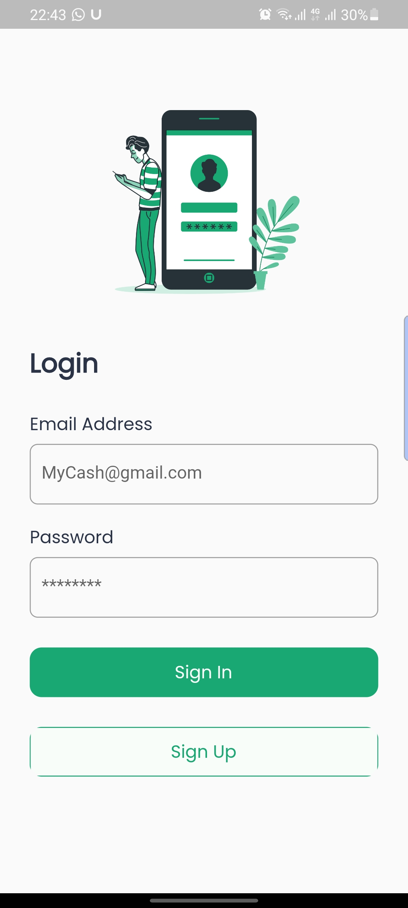
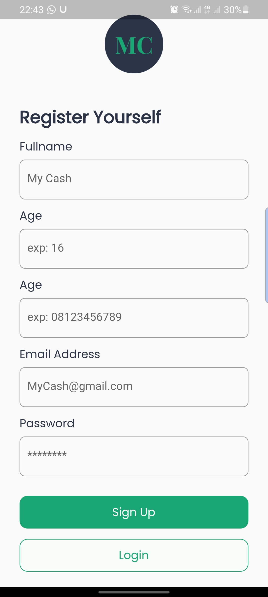
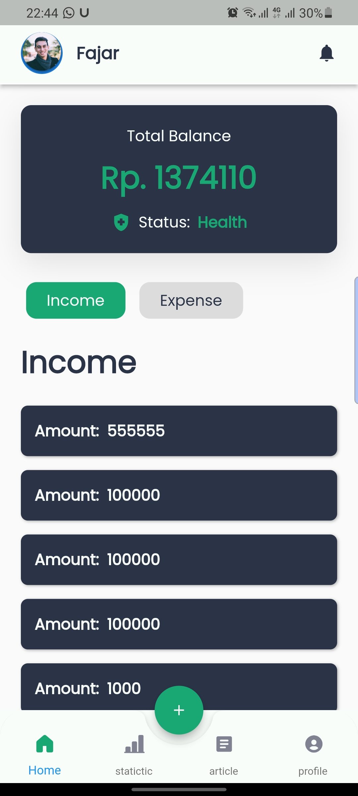
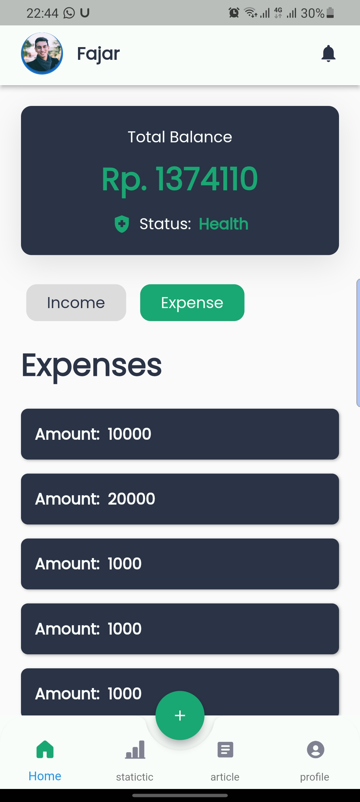
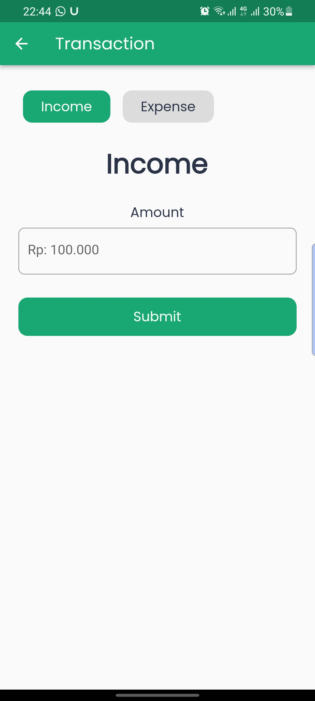
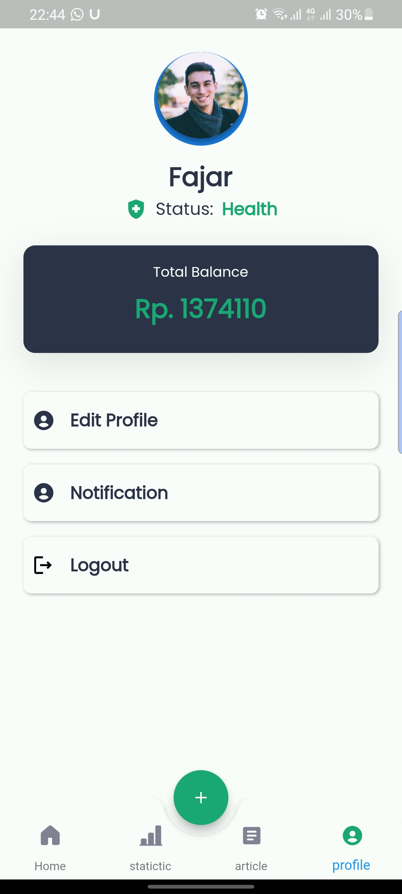

# My Cash FE(Flutter)

Full-stack Financial Management app is written in flutter and dart using go API. 


## **Image Gallery**

<hr/>

<br>


<p align="center">












</p>
<hr/>


## **Dependencies**

- [cupertino_icons](https://pub.dev/packages/cupertino_icons)
- [http](https://pub.dev/packages/http)
- [provider](https://pub.dev/packages/flutter_bloc)
- [flutter_svg](https://pub.dev/packages/flutter_svg)
- [google_font](https://pub.dev/packages/google_font)
- [introduction_screen](https://pub.dev/packages/introduction_screen)
- [flutter_local_notifications](https://pub.dev/packages/flutter_local_notifications)
- [form_field_validator](https://pub.dev/packages/form_field_validator)
- [timezone](https://pub.dev/packages/timezone)
- [flutter_native_timezone](https://pub.dev/packages/flutter_native_timezone)
- [d_chart](https://pub.dev/packages/d_chart)


## **How to run?**

To clone and run this application, you'll need [Git](https://git-scm.com/downloads) and [Flutter](https://flutter.dev/docs/get-started/install) installed on your computer. From your command line:

### first setup backned from here

[Backend setup](https://github.com/Ansh-Rathod/Musive-Backend)
you can setup backend on heroku. i have attached some steps for setup in readme file of backend.
and edit api/url.dart file put your own url in baseUrl variable without "https://"

### Clone this repository

```bash
$ git clone https://github.com/Ansh-Rathod/Flutter-Musive-app.git
```

### Go into the repository

```bash
$ cd front
```

### Install dependencies

```bash
$ flutter pub get
```

### Run the app

```bash
$ flutter run
```
